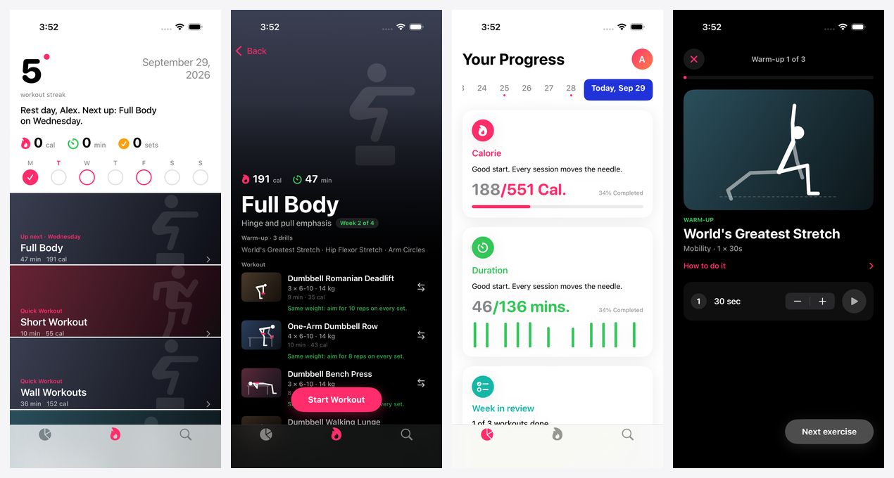
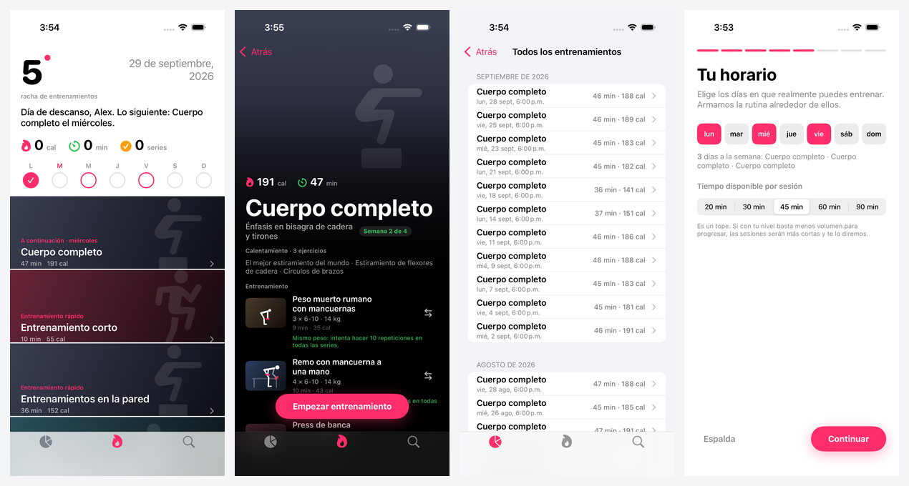
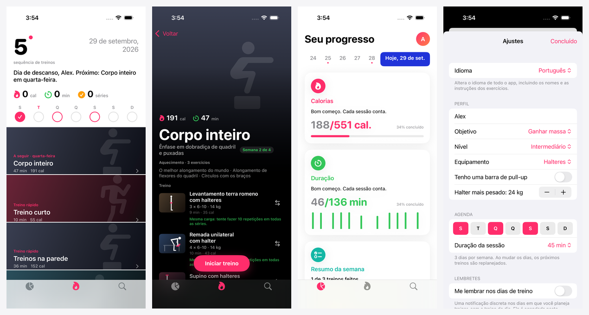

# Momentum

A free, fully offline iOS fitness app. No account, no ads, no subscription, no server. Everything (plans, history, weights) is stored on the device.

Built with SwiftUI and Swift Charts. Requires iOS 17+.

## What it does

- **Onboarding that sets you up properly.** Goal (build muscle, get stronger, lose fat, general fitness), training history, an optional strength check (push-ups, squats, plank, pull-ups), the actual weekdays you can train, session length, equipment (including your heaviest dumbbell), body areas to protect (knees, lower back, shoulders, wrists), low-impact mode, sex, age, weight and height. It ends with a preview of your plan. No accounts, no sign-in, no tracking.
- **A precise, explainable engine** (see [docs/ENGINE.md](docs/ENGINE.md)). Exercises are chosen by movement pattern, sized to weekly sets-per-muscle targets, fitted to your time, and never violate your protected areas or equipment. Every exercise shows *why* it's prescribed ("Up 2 kg: you hit 10 reps on every set").
- **Real progression.** Double progression per exercise (reps first, then load), correct load steps (dumbbell caps respected), bodyweight *ladders* (wall → knee → full → decline push-ups and so on) and holds that progress in seconds, plus deloads every few weeks, automatic deloads when you're worn out, gentle comebacks per lift after time off, and a daily "how do you feel" check.
- **Warm-up done for you.** Mobility drills for the day's muscles and ramp-up sets before your first heavy lift.
- **"I can't do this."** Swap any exercise by reason (too hard, too easy, it hurts, no equipment, don't like it) and get fitting alternatives, each with a one-line explanation. Choose whether it's just for today, remembered, or the original is never shown again.
- **Animated demonstrations.** All 75 exercises have a looping figure animation, with props (bench, chair, bar, dumbbells, barbell, cables), drawn in code from bundled data. Works offline and respects *Reduce Motion*.
- **Progress.** Weekly calories and minutes against your plan, weekly volume per muscle vs target, estimated 1RM and personal records, body-weight trend, streak.
- **History and your data.** Every workout with its sets, by month. Back up everything to one JSON file and restore it on another phone, or export the history as CSV. See [PRIVACY.md](PRIVACY.md).
- **Reminders** (optional). A quiet local notification on training days with that day's workout. Scheduled on the phone, nothing is sent anywhere.
- **Apple Health** (optional). Saves finished workouts and body weight; reads steps and active energy (including Apple Watch). Nothing leaves your device.
- **How-to videos.** Every exercise links to a YouTube proper-form search (curated URLs supported in `ExerciseLibrary.curatedVideos`).
- **English, Español, Português (Brasil).** The whole app, including exercise names and step-by-step instructions, the engine's "why" sentences and the Health permission prompts, follows your phone's language or one you pick in Settings (or on the first onboarding screen). See *Translations* below.
- **Quick workouts.** 10-minute blast, no-equipment full body, mobility & stretch.

Screenshots from the real app running in the iOS Simulator with demo data (generated by CI, see `.github/workflows/screenshots.yml`):





## Run it

You need a Mac with Xcode 15.3+ (this project was written for Xcode 16).

```sh
brew install xcodegen
xcodegen generate      # creates Momentum.xcodeproj from project.yml
open Momentum.xcodeproj
```

To put it on your own iPhone from the command line (Mac with Xcode, phone connected by cable):

```sh
scripts/install-on-phone.sh --team YOUR_TEAM_ID
```

See the header of that script for the one-time phone setup (Developer Mode, trusting your developer profile).

Or pick an iPhone simulator (or your device) in Xcode and press Run. To install on your own iPhone for free, select your Apple ID under *Signing & Capabilities → Team* (a free Apple ID works; the app just needs re-installing every 7 days).

Run the tests with `⌘U`. The engine and models are also a Swift package, so on any machine (including Linux CI) you can run the 120+ engine tests and a 16-week simulation without Xcode:

```sh
swift test
swift run EngineSim plans   # sample plans for four different people
swift run EngineSim sim     # 16-week simulation with a synthetic athlete (add -v for reasons)
swift run EngineSim alts    # alternatives for each swap reason
```

Or the iOS tests from the command line:

```sh
xcodebuild test -project Momentum.xcodeproj -scheme Momentum \
  -destination 'platform=iOS Simulator,name=iPhone 16'
```

A GitHub Actions workflow (`.github/workflows/ios.yml`) builds and runs the tests on every push.

See [CONTRIBUTING.md](CONTRIBUTING.md) to help, [docs/ARCHITECTURE.md](docs/ARCHITECTURE.md) for how the code fits together, and [docs/ROADMAP.md](docs/ROADMAP.md) for what is next.

## Project layout

```
Momentum/
  App/          App entry point, root + tab view
  Models/       Data types and the built-in exercise library
  Engine/       Assessment, PlanGenerator, Progression, Periodization (blocks, deloads, fatigue, volume), Alternatives, AdaptiveEngine
  Store/        AppStore: state + JSON persistence in Documents/
  Design/       Theme, shared components, FigureView (animation renderer) and MotionData (generated)
  Views/        Onboarding, Workouts, Progress, Explore, Settings
MomentumTests/  Unit tests for the engine and models
Tools/EngineSim/ Plan printer and longitudinal simulator
docs/           ENGINE.md (the specification) and screen mockups
tools/          Python authoring + preview tools for the exercise animations
project.yml     XcodeGen project definition
```

`Engine/` and `Models/` have no UI dependencies, so the training logic is easy to test and tweak.

## Tweaking the training logic

- Add or edit exercises in `data/exercises.json` (movement pattern, stress tags and ladder rung are fields there too), then run `python3 tools/exercises/export.py`. Add an animation in `tools/` and translations in `tools/i18n/exercises.py`. `load` is a typical working weight as a fraction of body weight.
- Change templates in `SessionFocus` and weekly targets in `VolumePlanner`.
- Change progression rules in `Progression`, deloads and fatigue in `Periodization`, level/rung changes in `AdaptiveEngine`.
- Every rule is written down in [docs/ENGINE.md](docs/ENGINE.md); change both together.

## Translations

English text is the lookup key (`L("Up {0} kg: …", 2)`), so there are no string IDs to keep in sync. Tables for Spanish (neutral Latin American, "tú") and Portuguese (Brazil) live in `tools/i18n/strings_*.py` and `tools/i18n/exercises.py`, and are compiled into `Models/LocalizationData.swift` and `Models/ExerciseTranslations.swift`.

- Add or change text: wrap it in `L("…")` / `Lp(n, one:, other:)` / `LText("…")` (markdown), add the Spanish and Portuguese versions to the Python tables, then run `python3 tools/i18n/export.py --strict` (fails on missing keys or mismatched `{0}` placeholders) and commit the regenerated Swift files.
- SwiftUI's `Text("literal")` looks in the app bundle, not our tables, so always pass a string: `Text(L("…"))`.
- The engine tests run in English; `LocalizationTests` checks every key and exercise is translated, placeholders survive, and that switching language never changes which exercises are planned.
- To add a language: add a case to `AppLanguage`, a table per Python file, an `InfoPlist.strings` folder under `Momentum/Resources`, and list it in `project.yml`.

## Known limitations

- Translations were written by an AI assistant, not professional translators. Corrections are welcome (edit the Python tables and re-export).
- Exercise demos are stylised stick-figure animations, not video. Workout cards use gradients. See `tools/README.md` to edit or add animations.
- Calories are estimates from MET values, not measured.
- Apple Health needs a real signing team (a free Apple ID works) because HealthKit is an entitlement. There is no Apple Watch app yet, but Watch activity shows up through Health.
- YouTube links are searches unless you add curated URLs.
- Data lives only on the device. Deleting the app deletes your history unless you made a backup (Settings → Your data).
